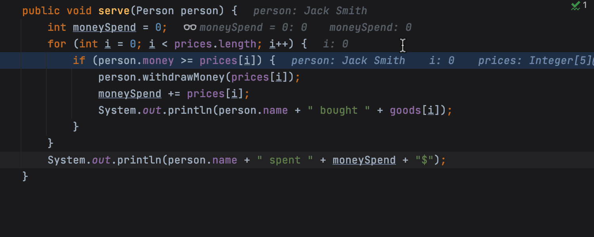

# IntelliJ IDEA - 2020.3 最新变化

## 用户体验

### 新的欢迎屏幕

IntelliJ IDEA 欢迎屏幕已重新设计。 初始向导已替换为包含四个选项卡的快速访问屏幕：用于管理项目的 _Projects_、用于设置 IDE 界面的 _Customize_、用于插件安装的 _Plugins_ 以及用于访问帮助和学习资源的 _Learn IntelliJ IDEA_。

### Learn IntelliJ IDEA

直接从欢迎屏幕打开 _Learn IntelliJ IDEA_ 选项卡。 您可以在这里找到交互式课程和有用的帮助链接。 点击 _Start Learning_ 在实际环境中逐步学习各种 IDE 功能。 请按照 _Learn_ 视图中的说明操作，在实际编码示例中测试您的新技能。

### IDE 主题已与操作系统设置同步

IntelliJ IDEA 现在可以将其主题与您的操作系统主题同步。 要启用此功能，请转到 _Settings / Preferences | Appearance & Behavior | Appearance_，然后勾选 _Sync with OS_ 复选框。 点击 _Sync with OS_ 旁边的齿轮图标来选择您的首选主题。

### 阅读器模式

现在，默认会在_阅读器模式_下打开只读文件和外部库中的文件。 在此模式下，注释看起来像启用了格式化的文本和字体连字，这有助于使代码更易于用户阅读。 您可以在 _Settings / Preferences | Editor | Reader Mode_ 中自定义阅读器模式设置。

### LightEdit 改进

在 IntelliJ IDEA 2020.3 中，我们改进了 _LightEdit_ 模式的用户体验。 要在 _LightEdit_ 模式下从命令行打开文件，现在可以键入 `-e` (`--edit`)，后跟要打开文件的名称，或者省略文件名以重新打开上一个会话。 可以通过 _LightEdit_ 窗口中的新状态栏访问整套 IDE 功能。 如果您想详细了解 _LightEdit_ 模式更新，请阅读此[博文](https://blog.jetbrains.com/idea/2020/10/intellij-idea-2020-3-eap4/)。

### 更好的拼写和语法检查工具

现在，当您按 Alt+Enter 时，IDE 会调用一些建议来更正您的语法或拼写。 更重要的是，我们开始使用新版本的 LanguageTool 语法检查引擎，此引擎改进了英语文本检查并添加了对 10 种以上语言的支持。

### Search Everywhere 更新

我们在 _Search Everywhere_ 对话框中添加了一个新的 _Git_ 选项卡。 现在，您可以在 _Search Everywhere_ 对话框中查找提交哈希和消息、标记以及分支。 您还可以在搜索字段中执行简单的数学计算。

### ☆☆☆预览选项卡

现在，您只需点击一下即可在预览选项卡中打开文件。 在预览选项卡中打开文件时，文件的名称以斜体显示。 如果您开始编辑此文件，它将不再是预览，而是变为一个普通文件。 如果点击另一个文件在预览模式下将其打开，它将显示在同一个选项卡中，替换之前打开的文件。 要启用此功能，请点击 _Project 视图_中的齿轮图标，然后选择 _Enable Preview Tab_。

### Linux 表情符号选择器

在 v2020.3 中，我们为 Linux 添加了表情符号选择器 🥳。 要打开表情符号选择器，请按 Ctrl+Alt+;。 您可以按类别筛选表情符号，更改其肤色并按名称搜索表情符号。 表情符号选择器完全支持键盘导航。

### ☆☆☆☆☆在 IDE 内部更新 JDK

从 v2020.3 开始，只要有可用的更新，就可以从显示的弹出窗口迁移到最新的 JDK。 您可以选择安装还是跳过。

## 编辑器

### ☆☆☆新的 Extract method 布局

我们简化了提取 Java 方法的过程 - 只需在 macOS 上按 ⌥⌘M、在 Windows 或 Linux 上按 Ctrl+Alt+M 或者选择 _Refactor / Extract / Introduce / Method…_，IDE 便会立即执行提取。

### ☆☆☆以更直观的方式访问 Rename 设置

通过内嵌提示中显示的新 Rename 偏好设置，现在可以选择是要重命名注释和字符串文字中的实例还是可打印文本中的实例。 要调用此提示，请在 macOS 上按 ⇧F6 或在 Windows 和 Linux 上按 Shift+F6，然后按 _Tab_。 您可以在 _Settings / Preferences | Keymap_ 中更改 _Show Options Popup for In-place Refactoring_ 的快捷键。

### 拖放选项卡

现在，如果要在处理项目时打开多个选项卡，可以拖放文件选项卡以水平或垂直拆分编辑器。 此外，我们还引入了 _Open in Right Split_ 操作，此操作可在文件处于打开状态时垂直拆分编辑器。 可从 _Project_ 视图或其他导航弹出窗口（例如 _Recent Files_、_Search Everywhere_ 和 _Navbar_）中调用此操作。

### 固定的选项卡改进

在 v2020.3 中，对于固定的选项卡，将显示新的固定图标。 当您点击它时，便会取消固定文件。 您还可以通过将选项卡拖放到其他固定或取消固定的文件上，以此来固定和取消固定选项卡。 如果您倾向于打开许多选项卡，则可以将所有固定的选项卡都放在一行中。 为此，请转到 _Settings / Preferences | Editor | General | Editor Tabs_，然后勾选 _Show pinned tabs in a separate row_ 复选框。

### 改进了 Markdown 编辑和预览

[Markdown 工具](https://www.jetbrains.com/help/idea/markdown.html)现在具有更好的预览 UI 和改进的 UX。 您可以在 _Settings / Preferences | Editor | Code Style | Markdown_ 中自定义 Markdown 格式。 在 macOS 上按 ⌘+Alt+L 或者在 Windows 或 Linux 上按 Ctrl+Alt+L 来应用格式设置。 编辑器右上角的 _Auto-Scroll Preview_ 按钮允许您同步滚动预览窗格和编辑器。 我们还添加了对 [Mermaid.js](https://mermaid-js.github.io/mermaid/#/) 的支持。

### ☆☆☆将 IntelliJ IDEA 设置为打开文件的默认应用程序

现在，您可以将 IntelliJ IDEA 设置为打开文件的默认应用程序。 在 _Preferences | Settings / Editor / File Types_ 中，点击 _Associate file types with IntelliJ IDEA_… 按钮。 在打开的对话框中，选择要在 IDE 中打开的文件的扩展名。 如果您使用 macOS，则需要重新启动计算机才能应用这些变更。

### 每个模板多个文件

在 _Preferences / Settings | Editor | File and Code Templates_ 中，现在可以添加会创建多个文件的模板。 首先，点击 + 新建一个模板。 要向其中添加另一个文件，请点击 + 旁边的 _Create Child Template File_ 图标。 在 _File name_ 字段中，您可以使用 _Description_ 部分中列出的变量输入模式以生成文件名和路径。

## 调试器

### ☆☆☆交互式提示

当您的应用程序在调试模式下运行时，您可以点击变量来获取内联提示，提示中包含可以更改其值的相关字段。 点击此新内联提示中的 _Create Renderer_ 可打开一个对话框，您将能够在其中配置所有调试器视图中内联值的显示。

### ☆☆☆内联监视

我们添加了一种新型监视表达式，这种表达式将与特定的上下文相关联并显示在编辑器中。 要创建这些新的监视表达式，可以在内联提示弹出窗口中点击 _Add as Inline Watch_，从上下文菜单中选择 _Add Inline Watch_，或者右键点击编辑器中的变量。 您可以在 _Debug_ 工具窗口的 _Variables_ 选项卡中的新 _Inline Watches_ 节点中管理内联监视。

### ☆☆☆Java 调试器中的基本内存分析

现在，当调试器运行时，可以使用基本的分析选项。 从 _Debug_ 工具窗口的上下文菜单中调用新的分析功能。 第一个功能是 _Show referring objects_，用于查找从对象到 GC 根的最短路径。 第二个功能是 _Calculate retained size_，用于计算对象的保留大小并显示其保留集。

### 更好地调试 Gradle

现在，对于 Gradle 任务，每个调试会话只打开一个选项卡。 它包含 _Frames_ 和 _Variables_，以及 _Console_ 输出。 调试器控件现在可以正常工作。 如果要回滚到以前使用的调试逻辑，请清除 _Edit configurations…_ 屏幕上的 _Reuse Gradle debug session for forked processes_ 复选框。

## 性能分析器

### 更新了 Profiler 工具窗口 ●Ultimate

在重新设计的 _Profiler_ 工具窗口中，可以将分析器附加到正在运行的应用程序。 在所有正在运行的 Java 进程的列表中，按 Enter 键以调用 _Attach Profiler to a Process_，然后选择要使用的集成工具。 在 _Recent Snapshot_ 区域中，您可以快速访问以前创建的任何快照。

### 火焰图搜索 ●Ultimate

火焰图搜索现在更人性化，具有可见的搜索字段、用于快速导航的向上/向下箭头，以及允许您在整个火焰图中或仅在特定子树中搜索的筛选器。

### 轻松访问 .jfr 和 .hprof ●Ultimate

不再需要费时费力地打开 `.jfr` 和 `.hprof` 文件！ 要快速打开这些类型的任何文件，只需将其拖放到编辑器中并使用 _File | Open_ 或者在 _Project_ 视图中双击该文件。

### ☆☆☆☆☆支持本地 Maven 和 Tomcat ●Ultimate

现在，可以像分析任何其他运行配置[一样](https://www.jetbrains.com/help/idea/2020.3/run-with-profiler.html#profile-run-configuration)分析本地 Maven 和 Tomcat 运行配置。 右键点击要分析的项，然后选择必要的分析选项：CPU、分配或 Java Flight Recorder。

## 版本控制

### ☆☆☆☆☆Git 暂存支持

现在，您可以直接从 IDE 暂存变更。 要启用此功能，请转到 _Settings / Preferences | Version Control | Git_，然后勾选 _Enable staging area_ 复选框。 点击 + 图标，将文件添加到 _Commit_ 视图的新 _Staged_ 节点中。 您还可以直接从间距或在 Diff 视图中暂存变更。 要了解详情，请阅读我们的[博文](https://blog.jetbrains.com/idea/2020/10/intellij-idea-2020-3-eap5/)。

### 重新排列了 VCS 菜单

现在，将根据您当前使用的版本控制系统来命名 VCS 菜单。 我们移除了对项目进行版本控制最有用的操作以外的所有其他操作，使菜单变得更加简洁。 如果您的项目仅使用 Git，则 VCS 菜单将如上图所示。

### 改进了分支

创建新分支时，IDE 会自动更正分支名称中未被接受的符号。 我们重新设计了当前分支的上下文菜单，以显示相关操作。 对于远程分支，我们将 _Merge into Current 和 Rebase Current onto Selected_ 操作分别重命名为 _Pull into Current Using Merge_ 和 _Pull into Current Using Rebase_。

## 运行配置

### 更新了运行/调试配置

我们重新排列了 _Run/Debug Configurations_ 以使其更加整洁，现在最常用的设置都位于一个屏幕中。 必填字段包含字段内标签，并且按与命令行相同的顺序排列。 如果需要配置其他参数，请点击 _Modify options_。

### ☆☆☆存储和共享运行/调试配置模板

在 IntelliJ IDEA 2020.3 中，您可以将运行配置模板存储为 XML 文件，然后通过 Git 或其他 VCS 与团队成员共享。 要启用这些功能，请转到 _Edit Configurations…_，展开 _Templates_ 节点，选择一个配置模板，选中 _Store as project file_ 复选框，然后定义用于存储此配置模板的路径。

## 协作开发

### ☆☆☆☆☆Code With Me EAP

IntelliJ IDEA 2020.3 支持 [Code With Me (EAP)](https://plugins.jetbrains.com/plugin/14896-code-with-me) – 一项用于协作开发和结对编程的新服务。 利用 Code With Me，您可以与其他人共享 IDE 中当前打开的项目，并实时协同处理。 从插件市场 (_Preferences / Settings | Plugins | Marketplace_) 中获取此服务。 查看[这些文章](https://blog.jetbrains.com/tag/codewithme)以详细了解 Code With Me。

## Java

### ☆☆☆转换记录

我们添加了一个新的意图操作，允许您将记录转换为类。 当您想要降级代码库时，此操作十分有用。 您可以在此[博文](https://blog.jetbrains.com/idea/2020/09/java-15-and-intellij-idea/)中阅读有关何时以及如何使用记录的信息。

### 全面支持密封类

在此版本中，我们为[密封类](https://openjdk.java.net/jeps/360)添加了补全、代码洞察和重构。 使用 _sealed_ 修饰符时，您会将一个类声明为_密封类_，它允许您定义哪些其他类可以扩展该类，以及哪些类可以防止被扩展。 子类可以是 final、non-sealed 或 sealed 类。 有关如何使用此功能的一些示例，请阅读此[博文](https://blog.jetbrains.com/idea/2020/09/java-15-and-intellij-idea/)。

### 代码补全中基于机器学习的排序

得益于更好地对建议排序并首先显示最相关项的全新机器学习技术，代码补全建议现在变得更加智能并且与上下文更相关。 要了解新排名系统如何更改建议的顺序，请转到 Settings / Preferences | Editor | General | Code Completion，然后勾选 _Mark position changes in the completion popup_ 复选框。

### Shebang (#!) 支持

如果文件使用 [Shebang 机制](https://blog.jetbrains.com/idea/2020/10/shebang-mechanism-support-in-intellij-idea-2020-3/)，IntelliJ IDEA 会自动识别这种情况，并允许您正确打开这些文件以及使用代码洞察。 也可以高亮显示带有 shebang (`#!`) 的文件。

### 新检查

在 IntelliJ IDEA 2020.3 中，我们引入了新的检查，可以帮助您改进代码。 最重要的检查之一是 _Commented out code_，它允许您删除或取消注释已注释掉的行。 您可以在此[博文](https://blog.jetbrains.com/idea/2020/10/intellij-idea-2020-3-eap4/)中详细了解 IntelliJ IDEA 2020.3 中的其他新检查。

### 更好的代码补全

从头开始创建类时，补全现在会在顶级 _Public_ 声明之后提供类、接口、枚举或记录。 如果您使用 `String.toUpperCase` 或 `String.toLowerCase` 方法，现在会提示您使用 _Locale.ROOT_。 当您要调用 `String.getBytes()` 时，IDE 会建议使用 _UTF\_8_ 字符集。

## Kotlin

### 新型内联重构

现在可以进行跨语言转换，这意味着您可以从 Java 内联 Kotlin 元素。 您还可以内联重构 _also、let、run、apply_ 和 _with_ 范围函数。 我们改进了 lambda 表达式的内联，使 IDE 可以更全面地分析其语法并正确设置其格式。

### 结构化搜索和替换

我们为 Kotlin 引入了对[结构化搜索与替换 (SSR)](https://www.jetbrains.com/help/idea/structural-search-and-replace.html) 操作的支持。 您可以查找和替换代码模式，并考虑源代码的语法和语义。 变量的筛选器允许您缩小搜索范围。

### 新架构

Kotlin IDE 插件的发布周期现在已与 IntelliJ IDEA 的发布周期同步。 我们还将 Kotlin IDE 插件移至新的存储库，此存储库与 IntelliJ IDEA 代码库组合，以最大程度地缩短我们获取平台变更所需的时间。

## 框架和技术

### 重新设计了 Endpoints 工具窗口 ●Ultimate

在此版本中，我们显著改进了 [Endpoints](https://www.jetbrains.com/help/idea/endpoints-tool-window.html) 工具窗口，它现在会显示 HTTP 和 WebSocket 协议的客户端和服务器 API。 它可以更方便地显示按模块分组的端点，并且可以选择让列表更加紧凑。 您可以将全面搜索与筛选器、多个搜索参数和补全一起使用。 您可以在新选项卡中阅读每个端点的文档。 如果端点具有关联的 URL，则可以看到它们的 Open API 表示并访问临时 HTTP 客户端。

### cURL 转换 ●Ultimate

现在，您可以通过在 HTTP 请求编辑器中按 Alt+Enter 并选择 _Convert to cURL and copy to clipboard_ 选项，将 HTTP 请求导出到 cURL。

### 更好的 URL 补全 ●Ultimate

URL 补全现在可提供更多信息，其中包含框架图标、HTTP 方法以及在其中声明端点的类或文件的源位置。 已弃用的 URL 以删除线格式显示。

### ☆☆☆☆☆URL 内嵌提示 ●Ultimate

我们添加了对 URL 的某些关键操作的快速访问。 点击 URL 旁边的地球图标可访问它们。 这些操作当前可用于 Spring MVC、WebFlux、Feign Client、JAX-RS、Micronaut 和 Retrofit 框架。

### Spring 更新 ●Ultimate

现在，我们支持对 Spring MVC 功能路由、RestOperations、Spring WebTestClient 和 Spring Reactive WebClient 的代码洞察。 我们还可以显示用它们声明的端点。 我们为 Kotlin Spring Security 项目添加了代码补全和导航功能。

### HTTP 请求转换 ●Ultimate

如果您仍然使用旧 HTTP 客户端格式的 HTTP 请求，则可以通过点击已打开请求顶部的 _Convert request to the new format_ 轻松转换它们。 其他方法包括通过 Project 视图中的上下文菜单或者从 HTTP 请求编辑器进行转换。

### Swagger 更新 ●Ultimate

我们显著改进了各种情况下的代码洞察，包括当您想要使用 `$ref` 关键字引用外部定义时。 作为另一项重要更新，我们添加了 Swagger Hub 支持，可从 Swagger Hub 获取公共和私有规范，并在 Endpoints 工具窗口中打开它们。 另一个优秀的功能是 Swagger UI 现在可与 Darcula 主题同步。

### Quarkus 和 Micronaut 运行配置 ●Ultimate

新的 Quarkus 和 Micronaut 项目具有自动创建的运行配置，这意味着您可以立即运行和调试应用程序。 如果您决定更改 _Edit Configurations_ 中的 Quarkus 设置，则 _Environment_ 部分将仅具有适用于 Gradle 或 Maven 的设置，具体取决于您使用哪种设置来构建自己的项目。

### @Query 注解中 Micronaut 数据的代码补全  ●Ultimate

IntelliJ IDEA 2020.3 为创建存储库接口时使用的预定义方法引入了补全功能。 我们还添加了对 Micronaut `@Query` 注解的支持，此注解在创建自定义查询时十分有用。 使用此注解，您可以将 JPQL 语言用于代码段。

## Scala

### 并行编译

现在，Scala 编译服务器可以并行编译独立的模块。 我们调整了默认 VM 选项，默认情况下最多支持 4 个编译线程，这有助于极大地加快编译速度。 如果您的计算机具有多个 CPU 核心与大量 RAM，请尽管调整默认值以进一步缩短编译时间。

### 编译图表

为了提高并行编译的效率，您可能需要优化项目模块的结构和编译服务器的 VM 选项。 我们添加了编译图表来帮助您解决此问题。 现在，您可以一目了然地判断何时需要优化。 例如，图表可以帮助您确定属于瓶颈的模块、提高线程数量的机会以及需要调整最大堆大小的情况。 通过加快编译速度并让您专注于动态图表，[“正在编译”](https://xkcd.com/303/)的画面现在已经一去不复返。

### 增强的软件包前缀

现在，Scala 插件可以将 IntelliJ IDEA 的_软件包前缀_与 Scala 的_链接的软件包子句_和_相对导入_结合使用。 尽管这些功能中的每一个都相当模糊，但这种组合提供了一个直观且内部一致的系统，而不是指数级地增加模糊程度（[更多信息](https://blog.jetbrains.com/scala/2020/11/26/enhanced-package-prefixes/)）。 您不再需要忍受空目录链或不断重复相同的软件包前缀。 您可以使目录和软件包保持干净整洁。

### MUnit 支持

Scala 插件已经支持 JUnit、ScalaTest、uTest 和 Specs2。 现在是时候向此列表再添加一个条目了。 对 MUnit 的支持现在可以提供所有通常的优势。

### Scala 3 改进

IntelliJ Scala 插件已包含对即将发布的 Scala 3 的支持，而且已经持续一段时间，我们正在努力跟上所有新的更新。 特别是，Scala 插件现在可以理解 [main 方法的新语法](https://dotty.epfl.ch/docs/reference/changed-features/main-functions.html)。 对 Hello Worlds 进行工程设计从未如此简单！

## JavaScript

### 集成的 TypeScript 和 Problems 工具窗口 ●Ultimate

我们已将 TypeScript 语言服务集成到 _Problems_ 工具窗口中，并移除了 _TypeScript_ 工具窗口。 进行此变更后，用户可以更轻松地在一个位置检查代码中的问题。 我们还将先前在 _TypeScript_ 工具窗口中可用的操作移动到状态栏上的专用微件中。

### 根据用例创建 React 组件 ●Ultimate

您的代码中有未解析的 React 组件吗？ 将脱字符号放到用例中，按 Alt+Enter，从列表中选择 _Create class/function component_，随后 IDE 将为您创建相关的代码结构。

查看 [WebStorm 最新变化](https://www.jetbrains.com/zh-cn/webstorm/whatsnew/2020-3/)，了解 IntelliJ IDEA 2020.3 中提供的其他 JavaScript 改进。

## Kubernetes

### 下载日志 ●Ultimate

现在，您可以将日志下载到本地计算机上 – 只需点击 _Services_ 工具窗口左侧窗格中的 _Download Log_ 按钮。 默认情况下，您的 pod 会保存到 _Scratches_ 和 _Consoles | Kubernetes Files | <context> | <namespace> | pods_ 中，但是，您可以在 _Settings / Preferences | Build, Execution, Deployment | Kubernetes_ 的 Pod Logs 部分中更改设置。

### Open Console 和 Run Shell ●Ultimate

_Services_ 工具窗口的左侧窗格中添加了两个新操作：用于连接包含控制台的容器的 _Open Console_ 以及用于启动 pod 容器的 Shell 的 _Run Shell_。 点击工具图标可以快速访问设置的 _Pod Shell_ 部分。

### 从 Kubernetes 加载 CRD ●Ultimate

现在可以从活动群集中自动加载 CRD 架构。 为此，请转到 _Preferences / Settings | Languages & Frameworks | Kubernetes_，然后勾选 _Use API schema from an active cluster_ 复选框。

## 数据库工具

### ☆☆☆☆☆使用 SQL 查询 MongoDB ●Ultimate

现在，您可以使用 SQL 查询 MongoDB 数据库了。 IntelliJ IDEA 2020.3 支持包含 _JOIN、WHERE、GROUP BY、HAVING、ORDER BY、LIMIT、OFFSET_ 等子句的 _SELECT_ 查询以及除 map、reduce、filter 和 let 以外的所有可用 [MongoDB](https://docs.mongodb.com/manual/reference/operator/aggregation/) 函数。 如果您想详细了解使用 SQL 查询 MongoDB，请阅读此[博文](https://blog.jetbrains.com/datagrip/2020/10/22/datagrip-2020-3-eap-3-sql-for-mongodb/)。

### Couchbase 支持和新的数据提取工具 ●Ultimate

IDE 现在支持 **Couchbase Query** 服务。 我们还引入了两个新的提取工具：_One-Row_ 和 _SQL-Insert-Multirow_。前者允许您将列复制到逗号分隔的字符串中，后者可生成包含多个要插入的新行的单个 _INSERT_ 语句。

## 其他

您还可以在日常工作中使用其他有用的更新：

*   即将发布的 Maven 3.7.0 将具有采用简化结构的[新 POM](https://issues.apache.org/jira/browse/MNG-6656)。 IntelliJ IDEA 2020.3 已经包括对它们的支持。
*   ☆☆☆☆☆[Lombok 插件](https://plugins.jetbrains.com/plugin/6317-lombok)现在是内置插件。
*   IntelliJ IDEA 可以直接从 JetBrains 的服务器为热门的 Maven 库下载共享索引。 如果您使用 IntelliJ Platform SDK 开发插件，则会自动下载共享索引。
*   我们更新了 UI，使软件在 macOS Big Sur 中看上去更美观。
*   _Preferences/Settings | Keymap_ 中提供了与 macOS 系统快捷键完全兼容的新键盘映射。
*   现在，我们默认使用 Git 格式创建补丁。

